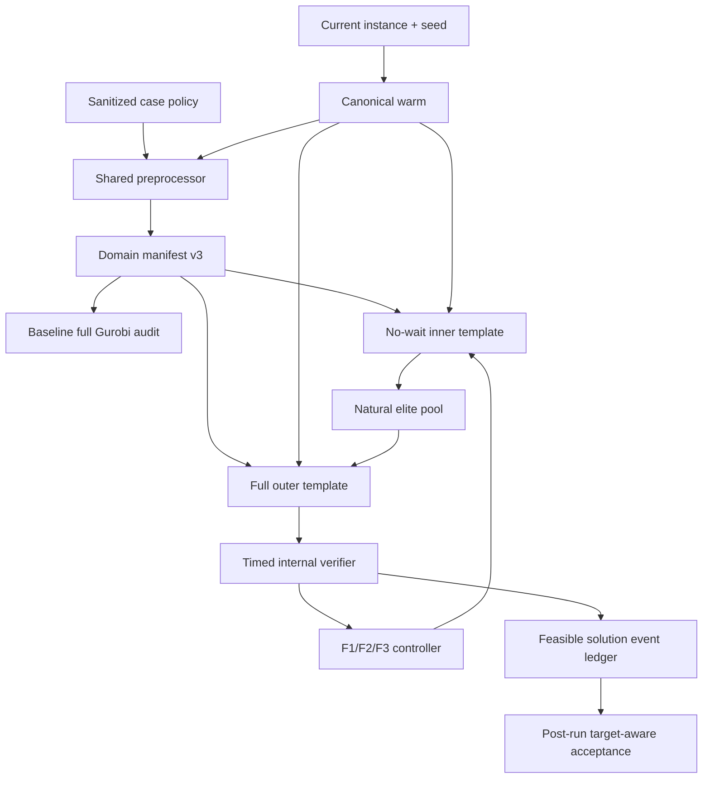

# 论文同构 TRA-Gurobi 实施蓝图

- 日期：2026-07-18
- 决策来源：ADR 0001、ADR 0002
- 范围：先完成 M1-M9 TRA-Gurobi；TRA-Fast 在其通过后另行实现

## 完成标准

1. 轮转顺序为 `F1(S_visit) -> F2(X_group) -> F3(R_assign)`；每次 inner
   Gurobi 固定另外两个核心块。
2. inner 是保留 route arc/time、删除 station rank/waiting 的显式松弛；outer
   是完整 `GlobalXYZU`。
3. baseline Gurobi、TRA inner、TRA outer 使用同一份 schema v3 manifest；算法
   层不再执行候选或弧剪枝。
4. outer 使用旧模型实际复合目标，只有完整可行且复合目标严格改进的解可更新
   incumbent。
5. 正式进程不知道旧 Cmax；目标只在日志冻结后的独立验收进程中出现。
6. M1-M9 verifier Cmax 等于 4.2，time-to-target 不超过旧 runtime 的 80%。

## 当前阻塞点

| 位置 | 当前行为 | 必须改造的原因 |
| --- | --- | --- |
| `Gurobi/tra_gurobi.py` | 仍含 `TARGET_CMAX`、target probe、controlled target polish，并调用旧 resource ALNS | 正式进程存在目标泄漏，且不是论文三过程内外层结构 |
| `Gurobi/resource_time_alns/fixgurobi_evaluator.py` | `_scope_for_layer()` 在 X/Y/Z 间做互补固定；payload 可固定 station rank 和 route sequence | 固定边界与论文相反，会锁死 outer 应释放的 rank/route |
| `Gurobi/master_domain.py` | schema v2 只有 slot、stack、route task/arc 和部分 warm hash | 无法证明 inventory action、数值界、目标和约束一致 |
| `Gurobi/global_xyzu.py::_prepare()` | 即使给 manifest，仍先重跑 dominance、warm bound 和 route prune 再覆盖部分集合 | 仍可能产生算法路径相关的数值界和隐式域漂移 |
| `GlobalXYZUSolver.solve_compiled()` | 每次复制整模；无解可 fallback 到 warm | 复制成本高，fallback 会把非候选解伪装成 outer 结果 |
| `experiments/m_current_tra_baselines.py` | 配置缺失时从历史 solution export 反推 sort threshold | 正式域构造读取了历史解结构 |

旧 `TRAOptimizer`、`_scope_for_layer()`、`_fixed_payload()` 和 route replay 不作为
新算法的基础类。可复用的是实例生成、`GlobalXYZU` 完整模型、canonical warm
生成器、库存/路线数据结构和只读时间计算器。

## 目标架构



`Baseline full Gurobi audit` 是正式 TRA 之前的域审计，只验证同域 Cmax 可复现；
它的 runtime 不替换 4.2 runtime，也不向 TRA 传递解。

## 数据契约

### DomainManifestV3

必须包含并分别 hash：

- 实例需求、库存层序、地图、station、robot、容量、速度和处理时间；
- work unit、slot、X keys 和 slot/time bounds；
- candidate stack 及全部 flip/sort/carry/hit/noise/flip-hit keys；
- station assignment/rank keys、route task/node/arc、travel time、robot eligibility；
- protected warm stack/task/action/semantic arc；
- route-node UB、arc Big-M、load bound；
- full objective、基础变量/约束、有效不等式和 symmetry fingerprint；
- 每条 prune 的 rule id、`safe/heuristic`、配置 provenance、before/after 和集合 hash。

consumer 模式只按 manifest 枚举域，不调用候选排序函数。任何 unknown/missing/extra
key、bound 或 fingerprint 都在计时前 fail closed。

sanitizer 的字段优先级固定为：历史 summary 的 effective diagnostic、历史
summary config、带代码版本证据的显式 legacy case profile。禁止回落到当前
helper、当前 dataclass 默认值或 solution export。每个非 summary 来源字段都必须
携带 `source` 和 `reason`。

### CoreProjection

```text
X_group[u]          -> exactly one slot
S_visit[slot,stack] -> exactly one station or inactive
R_assign[slot]      -> exactly one robot or inactive
```

主载体与原模型变量之间建立确定性双向投影。邻域 Hamming 只统计这三个载体，
不统计 `a/sku_use/pair_activate/passX/route_owner`。

### StructuralShell

outer 只固定：

```text
x
S_visit and Y_station
flip/sort/carry/hit/noise/flip_hit
R_assign
```

outer 不固定：

```text
Y_rank and station clocks
route_arc/route_time/route_load/route_finish
arrival/start/finish/order-time variables/Cmax
```

### FeasibleSolutionEvent

每条 JSONL 事件至少包括：

```text
run_id, case, wall_timestamp_sec, cycle, procedure, neighborhood
manifest_sha256, objective_sha256, structural_hash
solver_objective, solver_cmax, verified_cmax
internal_feasible, verifier_error_codes, provenance
snapshot_sha256
```

日志 append-only；验收器只读，不允许修复。

## Inner Model

inner 使用与 full 相同的 X、inventory、visit、robot assignment 和 route domain。
保留 route flow、pickup-delivery、时间/载荷递推及有效 workload/intrinsic lower
bounds。删除 `Y_rank`、rank unique/no-hole、station clocks、station predecessor
waiting 及依赖它们的 symmetry；设置：

```text
arrival_R[slot] >= active delivery route_time
start_R[slot] = arrival_R[slot]
finish_R[slot] = start_R[slot] + baseline station workload
Cmax_R >= finish_R[slot]
```

优化目标 `F_relax` 是 full 复合目标的证明性松弛。实际 full 目标为：

```text
Cmax
+ kitting_span_penalty_weight * sum(order_span_overrun)
+ 0.005 * sum(active_slot)
+ 0.001 * sum(route_tau * route_arc)
```

旧配置中的 `deadline_penalty_weight` 未进入实际目标，正式路径不得补加。

`repair_risk` 独立计算 station arrival overlap、queue workload、slack、warm
disturbance 和邻域距离。它只排序自然精英池，不进入目标或硬剪枝。

## Neighborhoods

| Procedure | Fixed | Released | N1 | N2 | N3 |
| --- | --- | --- | --- | --- | --- |
| F1 | X + R | S | 一个 visit relocate | 两个 visit station/active label swap | 至多四个 visit assignment 改变 |
| F2 | S + R | X | active slots 间一个 unit relocate，源保持非空 | 两个 unit 交换 slot | 至多四个 unit assignment 改变 |
| F3 | X + S | R | 一个 active slot 改派 robot | 两个 slot 交换 robot | 至多四个 robot assignment 改变 |

原始 one-hot Hamming 上限依次为 2、4、8。N2 需要标签计数守恒约束，避免
`distance<=4` 退化成两个任意 relocate。

## Controller

1. canonicalize 当前 incumbent，仅交换完全等价实体并验证 Cmax 不变。
2. 按 F1/F2/F3 选择 procedure，计算 fixed-pair certified LB。
3. `LB >= incumbent - tol` 时证明性跳过；小 gap 进入 deferred queue，其余运行
   inner。
4. inner callback 自然收集最多 8 个互异 structural shell，不主动搜索 pool。
5. 从非支配池选一个 repair risk 最低候选进入 outer。
6. outer 固定 structural shell，释放 route/rank/time，使用当前 incumbent 复合
   cutoff；无 incumbent 时不设 cutoff。
7. 验证 outer MIPSOL 事件；严格复合目标改进才更新 incumbent。
8. 改进后所有 procedure 回到 N1，并失效旧 incumbent 的 LB/deferred 证书。

停止条件：达到 `0.8 * old_runtime`、50 个 procedures，或 deferred queue 清空后
连续三个完整 F1-F2-F3 周期无内部可行改进。

## Outer Status

| 结果 | 处理 |
| --- | --- |
| full feasible 且复合目标严格改进 | 接受并更新 incumbent |
| optimal/infeasible/cutoff 且 bound 已证明无改进 | `proved_reject` |
| time limit、无改进解、bound 仍有潜力 | `unresolved`，进入一次 reserve retry |
| reserve retry 仍超时 | `budget_exhausted`，不得声称 infeasible |
| warm fallback、历史 replay、无 verifier 的 candidate | 正式路径硬失败 |

接受容差统一为 `max(1e-6, 1e-8 * max(1, abs(incumbent_obj)))`。`ObjVal` 不作
证明；`ObjBound` 只能证明其所属 fixed projection + neighborhood。

## Runtime Scheduler

每例硬预算 `B_case=0.8*old_4.2_runtime`。初始配额：30% inner、55% outer、
15% N3/deferred retry。配额是调度目标，不是可以越过总预算的独立池。

- 严格保持 F1/F2/F3 周期；只调整 time slice 和 neighborhood level。
- 每个 procedure 最多首次 outer 一次；每个 unresolved shell 最多 reserve retry
  一次。
- 新 outer 的 time limit 必须扣除 model reset、snapshot 和内部 verifier 的
  预测开销，避免 solver 在总预算终点才返回。
- compile、manifest 和 canonical warm 在计时前；model reset、bound update、
  MIP start、callback、solve 和 internal verifier 全部计时。

## 代码改造顺序

1. `experiments/m_current_tra_baselines.py`
   - 改为 summary config/diagnostics 白名单 sanitizer。
   - 删除 `_sort_hit_tote_threshold_from_export()` 的正式用途。
   - M1 写入 `enable_sort_hit_tote_threshold=false` 的 legacy profile；M2-M9 写入
     enabled、threshold 3。缺失字段不得回落到当前 dataclass 默认值。
   - 产出不含 Cmax 的 domain policy 和仅含 runtime 的 budget policy。
2. `Gurobi/master_domain.py`
   - schema v2 升 v3；补齐实体、数值界、规则 provenance 和分区 hash。
   - 提供只读 `PreparedDomainFromManifest`，禁止 consumer 二次剪枝。
3. `Gurobi/tra_projection.py`（新增）
   - 定义三类 carrier、inactive sentinel、canonicalization、hash、Hamming 和
     structural shell round-trip。
4. `Gurobi/tra_relaxed_model.py`（新增）
   - 构造无 station waiting 的 inner persistent template。
   - 实现 F1/F2/F3 bound fixing、local branching、LB 和自然精英池 callback。
5. `Gurobi/global_xyzu.py`
   - 暴露 full projection registry 和 persistent outer adapter。
   - 无解返回结构化 status，不再抛错后 warm fallback。
   - 支持只固定 station marginal，不固定 rank；禁止正式 route sequence fixing。
6. `Gurobi/tra_scheduler.py`（新增）
   - 实现严格轮转、预算、deferred/unresolved queue 和 provenance ledger。
7. `Gurobi/tra_gurobi.py`
   - 替换正式入口为 paper TRA engine；不导入 target、旧 ALNS 或 replay。
   - 如需保留旧实验入口，移到明确标记的 legacy 模块，正式 runner 不导入它。
8. `experiments/run_m_tra_gurobi_formal.py`（新增）
   - 只接受 instance/domain-policy/runtime-policy/manifest/output 参数。
   - 独立 target-aware harvest 命令在运行结束后执行。

## 验证闸门

### 单元测试

- manifest canonical JSON/hash、unknown/missing key fail closed；
- warm protected 实体都是有效域子集；
- 三类 projection round-trip 和 inactive 语义；
- N1/N2/N3 分别产生 Hamming 2/4/<=8；
- outer status 不把 timeout 当 infeasible；
- formal runner 遇到 target、BestObjStop、replay/export 字段立即失败。

### 数学差分测试

- Tiny/Small 随机 full-feasible 解投影到 inner 必须可行；
- 同一 fixed shell 上 `F_relax_opt <= F_outer_opt + tol`；
- outer fixing前后，rank/route arc/time 的非固定变量数不变；
- baseline full template 与 TRA outer 的 objective/base-constraint/bound hash 相等；
- inner/full 的 slot、stack、inventory action、station-task、route node/arc 分区 hash
  相等。

### 运行测试

- 无任何 pre-timer optimize/presolve/root relaxation；
- 每个 timed solve 后临时 bounds/params/callback 完整恢复；
- callback 事件按时间递增，snapshot hash 可回放，verifier 不修复；
- hard budget 包含 model update、solve 和 internal verifier；
- 无解、timeout、cutoff、optimal、首次无 incumbent 五种状态均覆盖。

### M1-M9 闸门

1. 先生成 M1 manifest，并以自然 Gurobi 同域审计旧 Cmax；失败则输出首个 domain
   diff，不运行 TRA。
2. M1 TRA-Gurobi 同时通过 Cmax、time-to-target、target-blind 和 manifest audit
   后才进入 M2。
3. 按 M1 到 M9 逐例推进；任何 case 失败先修契约或算法，不用历史结构补解。
4. TRA-Gurobi 九例全部通过后，冻结其实现和结果，再启动 TRA-Fast。

## 明确不做

- 不把整个 `U` 当第三核心块；
- 不在 inner 删除 route arc；
- 不在 outer 固定 station rank、route sequence 或连续时间；
- 不修正旧目标中未生效的 deadline penalty；
- 不用历史 solution/export/replay 扩域、保边或 warm start；
- 不在正式计时后继续 Gurobi repair/polish；
- 不用旧 Cmax 调参、停止、cutoff、probe 或筛选日志事件。

## 主要风险

| 风险 | 影响 | 控制措施 |
| --- | --- | --- |
| M1-M9 summary 来自不同代码版本 | 缺失字段若套当前默认值，会改变约束或域 | effective diagnostics 优先；显式 legacy profile；full model fingerprint audit |
| dedicated inner 漏掉 full 的结构约束 | `F_relax` 可能不是合法松弛或候选不可修复 | full-to-inner 投影可行性和固定 shell objective inequality 差分测试 |
| persistent model 临时状态残留 | 下一 procedure 的可行域被污染 | 统一 mutation registry；每轮前后 fingerprint/bound/parameter reset 断言 |
| outer callback 快照与 verifier 开销 | 侵占 20% 加速预算或越过硬截止 | 稀疏快照、仅记录新复合 incumbent、预留验证 guard，所有开销计时 |
| warm 不是完整 full-feasible 解 | 搜索初期无 cutoff，首个 outer 较慢 | 允许无 incumbent 启动；禁止计时前免费 repair；首轮优先低风险结构 |
| 复合目标与 Cmax 非严格等价 | 更低 Cmax 不能直接覆盖更差复合目标 | outer 严格按旧目标接受，同时记录所有完整可行 Cmax 供事后审计 |
